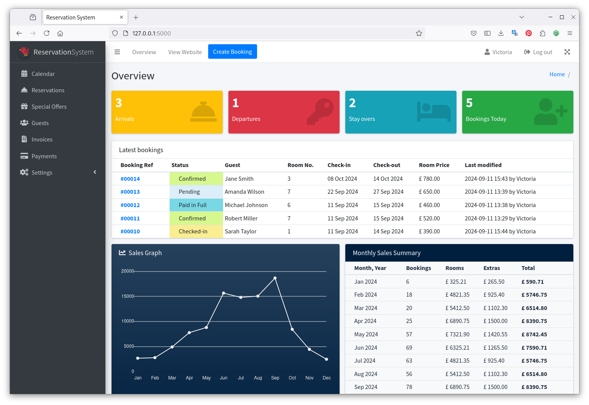

# Hotel Reservation System

Part of Open University TM470 Final IT Project

Python application using Flask framework.



## Setup environment

#### Check dependencies:

```
$ python --version
Python 3.11.6
```

#### Install pip 
https://packaging.python.org/en/latest/guides/installing-using-linux-tools/

```
$ sudo dnf install python3-pip python3-wheel

$ pip --version
pip 22.2.2
```

#### Install pipenv 
https://pipenv.pypa.io/en/latest/index.html

```
$ pip install pipenv --user

$ pipenv --version
pipenv, version 2023.12.1
```

Create and activate the virtual environment and spawn a shell within it
```
pipenv shell
```
Install packages
```
pipenv install [OPTIONS] [PACKAGES]...
```

## Creating Flask application

### Install Flask

```
$ pipenv install Flask
```

### Developing a hotel reservation application

The application builds upon steps from tutorial https://flask.palletsprojects.com/en/3.0.x/tutorial/

#### Initialise database
```
$ flask --app reservation_system init-db
$ flask --app reservation_system dummy-data
```

#### Run app with debugger
```
$ flask --app reservation_system run --debug
```
###
Log in to the system as username 'admin' with password 'dev'.

#### Styles

Admin views are styled with AdminLTE (https://adminlte.io/)

### Run the tests

#### Coverage with Pytest
```
$ coverage run -m pytest
```
#### View report in terminal
```
$ coverage report
```
#### Generate reports

This then works with Coverage Gutters VS Code extension to view coverage in module's python files.
```
$ coverage xml
```

## TODO / Features

### Booking overview (homepage)

- [x] Arrivals / Departures
- [x] Recent bookings
- [ ] Revenue summary

### Calendar

- [x] Calendar month view
- [x] Only allow future bookings
- [x] Prevent bookings overlapping dates or "double bookings" for same dates

### Rooms / Room Types

- [x] Add special offers/discount rates
- [x] Photo uploads
- [ ] Amenities list

### Customers

- [x] Add new guest details at booking time (currently a guest must be created before creating a reservation)
- [ ] Allow multiple rooms per booking

### Invoicing

- [x] Calulate full booking price
- [x] Print invoice
- [ ] Print revenue report

### Users

- [ ] Create new users
- [ ] Update/delete users
- [ ] Different permission levels?

### Code

- [x] Refactor row query functions
- [ ] Would type hints help?
- [ ] Write tests
